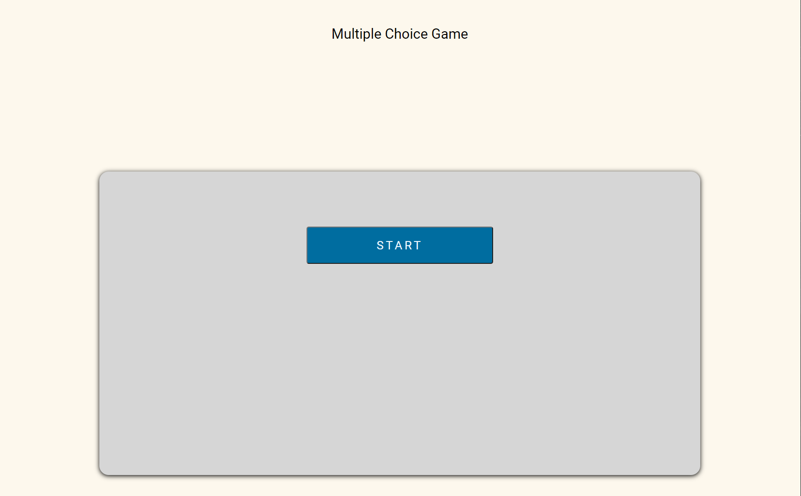
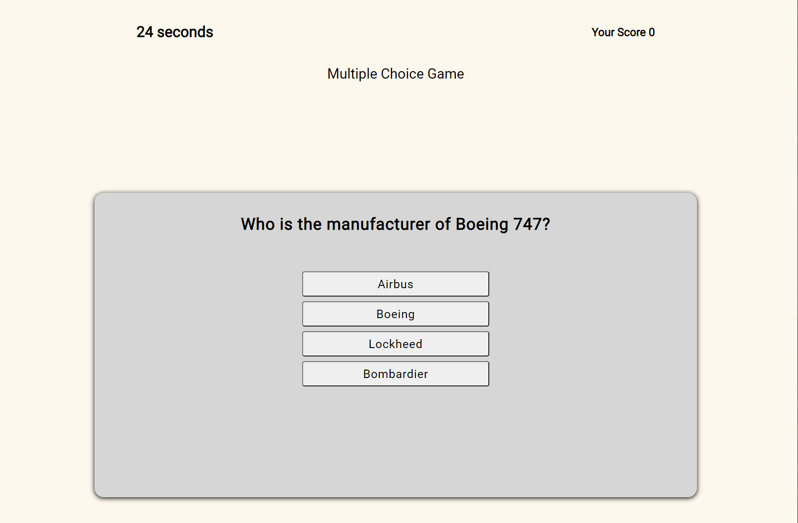
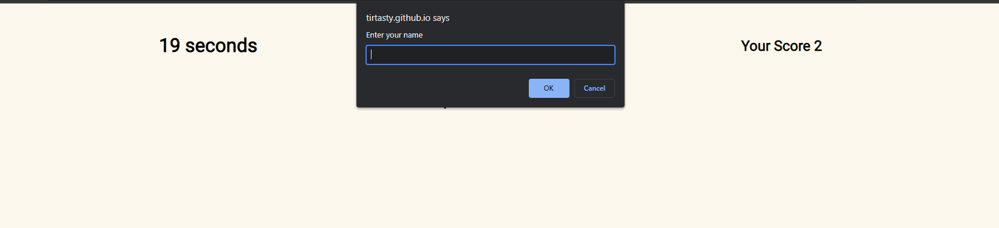
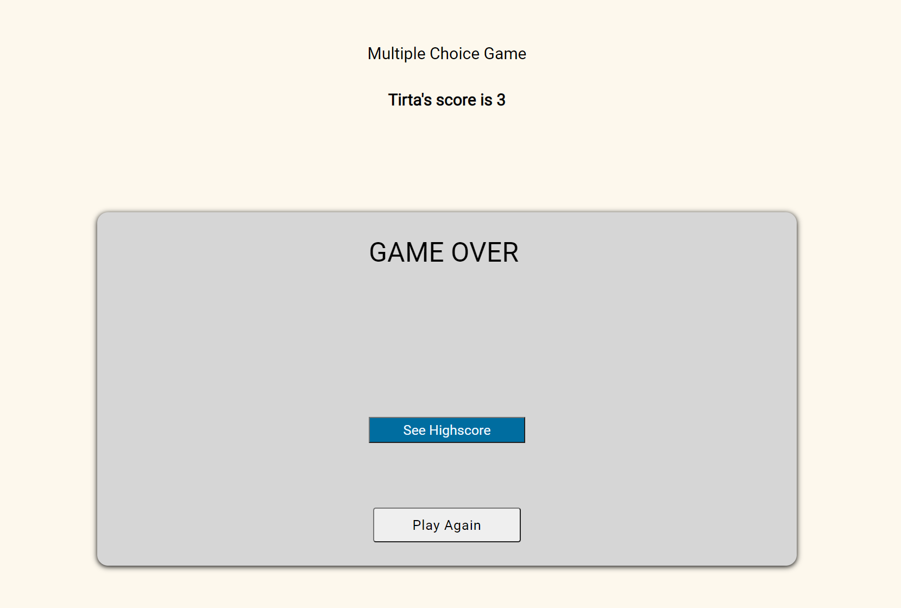
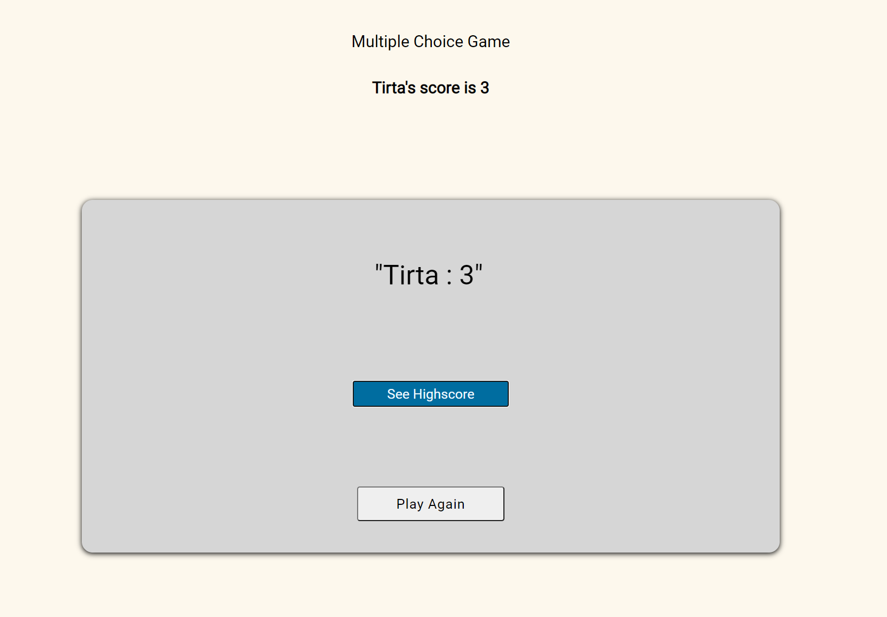
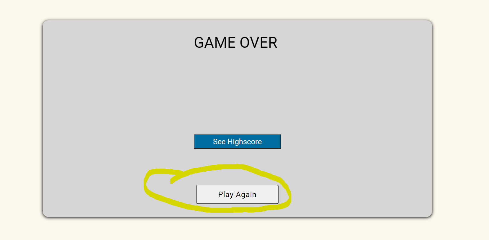

# Multiple Choice Game

---

## Motivation

The motivation behind this project is t implement what i have learnt such as data attributes, Eventlistener, Local Storage and much more.

---
## Installation

The Installation of this webpage will be straight forward simply click the links below or 
copy the links to the browser you are going to use, to achieve the best experience of 
this website make sure you are using desktop.

Github link is provided to further check and test.

* Webpage Link
https://tirtasty.github.io/Modern-Plane-Multiple-Choice-Game/

* Github Link
https://github.com/tirtasty/Modern-Plane-Multiple-Choice-Game.git

---

## Usage

** Once you launch the page, the homepage will be serve with "Start" button as picture below and once you click the button tge game will begin.

** And then the game begin, timer start counting down for 30 seconds, the question appears and once you hit the correct asnwer, your score will inrement but once you hit a wrong answer the time will taken for 10 seconds. You will have 4 question in the game.

** Once you answer all the question or you fail to finished the game by keep hitting wrong answer. Game Over message will appear follow with promt to fill your name in it so we can keep track the high score for futur reference.

** And there is highscore button which keep track the score everytime we play.

** And there is play again button if you want to play again.

** This the demo how the app will works

---
## Contributors

- Tirta Styadi - <tirta.setiady@yahoo.com>

---

##

© Tirta Styadi, University Of Sydney Coding Bootcamp